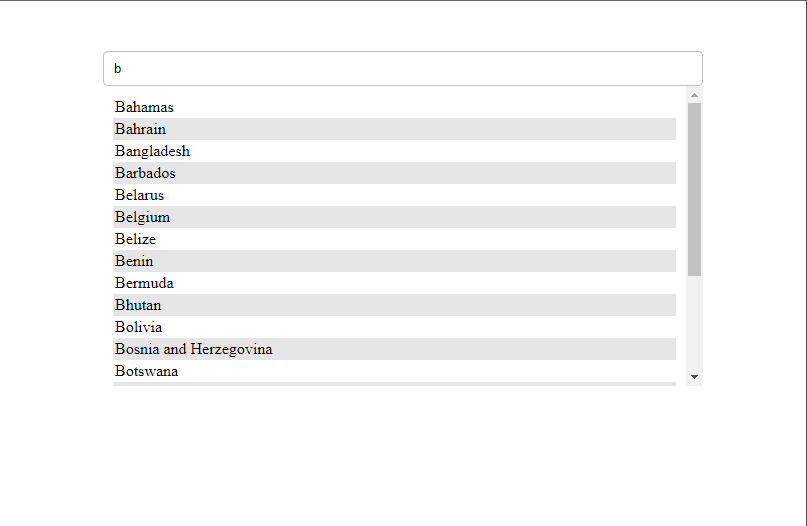

# Autocomplete or Typeahead Suggestions

Typeahead, or autocomplete, is a feature in which an application guesses the rest of a word as the user inputs it.

## Features

- [x] On typing inside search box it should suggest option.
- [x] Users should be able to select one of the options.
- [x] Avoid unnecessery network call.
- [ ] Cache.

## Screenshots

